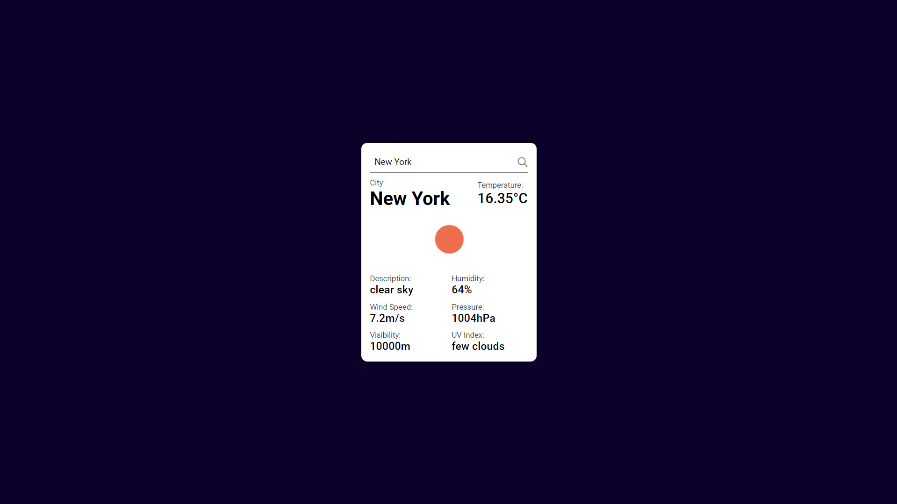

# Weather App

**Weather App** is a dynamic web application that provides real-time weather updates for any location. Built with HTML, CSS, and JavaScript, this app fetches weather data from a public API and displays current conditions, temperature, and forecast. With a user-friendly interface and responsive design, this app helps users stay informed about the weather anywhere, anytime.

## Features

- **Real-Time Weather Updates**: Get current weather conditions for any location.
- **Weather Details**: Displays temperature, humidity, wind speed, and weather conditions.
- **Search Functionality**: Allows users to search for weather updates by city name.
- **Responsive Design**: Adapts to different screen sizes for optimal viewing on any device.
- **API Integration**: Fetches data from a public weather API.

## Demo



## Getting Started

Follow these instructions to get a copy of the project up and running on your local machine.

### Prerequisites

You will need a modern web browser and an internet connection to use the app.

### Installation

1. Clone the repository:
   ```sh
   git clone https://github.com/HannanDeveloper01/Weather-App.git
